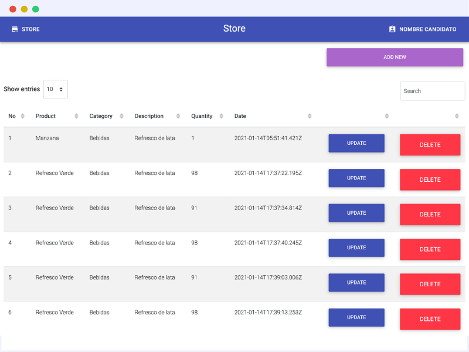

<p align="center">
  <a href="https://github.com/BlakePro/ExampleNextNestReact">
    Example of how to use NextJS, NestJS, React" width="40%" height="40%">
  </a>
  <h3 align="center">Example of how to use NextJS, NestJS, React</h3>
</p>


# Frontend

### CLI
```
cd frontend
npm i
npm run dev
```

Open [http://localhost:8882](http://localhost:8882) with your browser to see the result.

# Backend (RESTAPI Doc)

### CLI
```
cd backend
npm i
npm run start:dev
```

Where full URLs are provided in responses they will be rendered as if service
is running on 'http://localhost:8333/'.

## Open Endpoints

Open endpoints require no Authentication.

### Endpoints

Endpoints for viewing and manipulating the Accounts that the Authenticated User
has permissions to access.

* Get all Products : `GET /v1/products/`
* Get Single Product : `GET /v1/products/:IdProduct`
* Add Single Product : `POST /v1/products/:IdProduct`
* Update Single Product : `PUT /v1/products/:IdProduct`
* Delete Single Product : `DELETE /v1/products/:IdProduct`

### Header
  * `Content-Type: application/json`

### Body JSON
```json
{
    "NameProduct": "Manzana Verde",
    "Category": "Bebida",
    "Description": "Refresco de lata",
    "ProductQuantity": 1,
    "Status": true
}
```

## Success Responses

**Message** : String response

**Status** : `200`

**Product** : JSON product response

**Content example** : For the example above, when the 'name' is updated and
posted to `/v1/product/:IdProduct`...

```json
{
    "message": "Product update",
    "product": {
        "NameProduct": "Manzana Verde",
        "Category": "Bebidas",
        "Description": "Refresco de lata",
        "ProductQuantity": 15,
        "Status": true,
        "TimeStamp": "2021-01-13T23:22:47.486Z",
        "IdProduct": "5fff80c748c2be80a36d34c3"
    },
    "status": 200
}
```

## Error Responses

**Message** : JSON response

**Status** : `403`

**Content example** : For the example above, when the 'name' is post and
posted to `/v1/product`...

```json
{
    "message": {
        "Category": {
            "name": "ValidatorError",
            "message": "`nr` is not a valid enum value for path `Category`.",
            "properties": {
                "message": "`nr` is not a valid enum value for path `Category`.",
                "type": "enum",
                "enumValues": [
                    "Bebidas",
                    "Limpieza",
                    "Botanas",
                    "Cremeria"
                ],
                "path": "Category",
                "value": "nr"
            },
            "kind": "enum",
            "path": "Category",
            "value": "nr"
        }
    },
    "product": {},
    "status": 403
}
```


# CLI Usage
```
nest new backend
yarn create next-app frontend
brew install mongodb-community
```

# Versions
node v12.13.0
npm v6.14.9
yarn v1.22.10

# Author
`Cristian Yosafat Hernández Ruiz`
